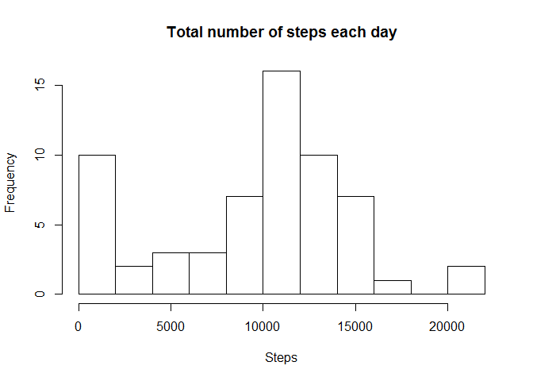
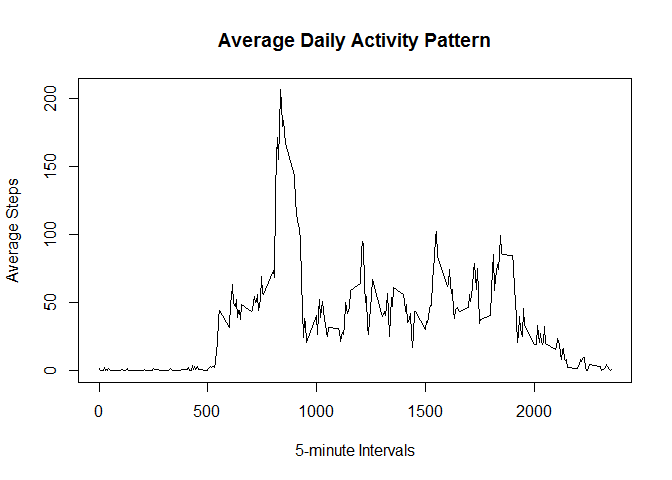
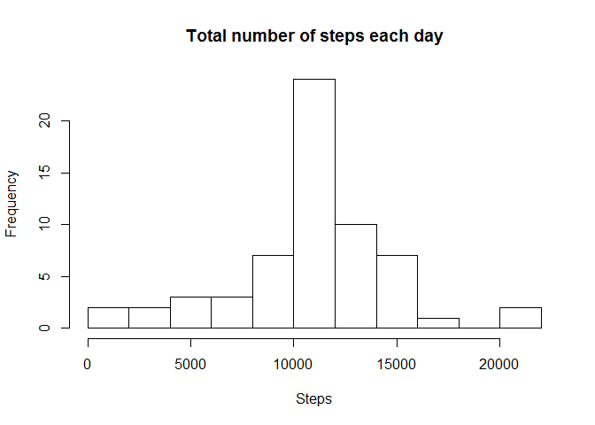
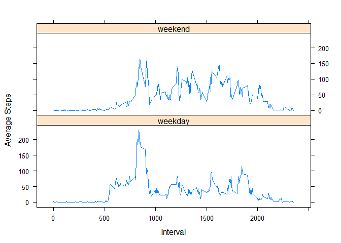

# Reproducible Research - Project 1
Pavel Borisov  
17 апреля 2016 г   


```r
knitr::opts_chunk$set(echo = TRUE)
# Set local settings
Sys.setenv(LANGUAGE = "en")
Sys.setlocale(category = "LC_ALL", locale = "C")

# Import needed libraries
library(lattice)
library(plyr)
```


## Loading and preprocessing the data

```r
# Get data from the file
data <- read.csv("Data\\activity.csv", header = TRUE)
data$date <- as.Date(as.character(data$date))
```

## What is mean total number of steps taken per day?

```r
# Calculate total number of steps per day. We use function to imply na.rm = TRUE
stepsPerDay <- ddply(data, ~date, summarise, steps = sum(steps, na.rm = TRUE))

# Making histogram of total number of steps
hist(stepsPerDay$steps, breaks = 10, xlab = "Steps", main="Total number of steps each day")
```



```r
# Calculate mean and median
mean(stepsPerDay$steps)
```

```
## [1] 9354.23
```

```r
median(stepsPerDay$steps)
```

```
## [1] 10395
```

## What is the average daily activity pattern?

```r
# Find the average number of steps taken per 5 minute interval
intervalAverage <- ddply(data, ~interval, summarise, mean = mean(steps, na.rm = TRUE))

# Make a time series plot of the 5-minute interval and the average number of
# steps taken, averaged across all days
plot(intervalAverage, type = "l", main = "Average Daily Activity Pattern", 
     xlab = "5-minute Intervals", ylab = "Average Steps")
```



```r
# Find interval that contains the maximum number of steps
intervalAverage[which.max(intervalAverage$mean), "interval"]
```

```
## [1] 835
```

> As we can see from the plot, avarage daily activity includes some peaks and the biggest one is on the 08:35 am.

## Imputing missing values

```r
# Calculate number and part of missing values
sum(is.na(data$steps))
```

```
## [1] 2304
```

```r
sum(is.na(data$steps))/length(data$steps)
```

```
## [1] 0.1311475
```

> There are 2304 NA values in original data set, which is about 13%. It is quiet a lot so we would try to impute them
> by changing to the average value in the same interval.
 

```r
# Get rid of NA values, changing them on average per interval values
data2 <- data
for (i in 1:nrow(data2)) {
  if (is.na(data2$steps[i])) {
    i_imputed <- which(intervalAverage$interval == data2[i, ]$interval)
    data2$steps[i] <- intervalAverage[i_imputed, ]$mean
  }
}
data2$date <- as.Date(as.character(data2$date))

# Calculate total number of steps per day. We use function to imply na.rm = TRUE
stepsPerDay2 <- ddply(data2, ~date, summarise, steps = sum(steps, na.rm = TRUE))

# Making histogram of total number of steps
hist(stepsPerDay2$steps, breaks = 10, xlab = "Steps", main="Total number of steps each day")
```



```r
# Calculate mean and median
mean(stepsPerDay2$steps)
```

```
## [1] 10766.19
```

```r
median(stepsPerDay2$steps)
```

```
## [1] 10766.19
```

> As we can see imputing NA values makes mean slightly bigger than the average value of steps
> from data with not imputed NAs.

## Are there differences in activity patterns between weekdays and weekends?

```r
# Add weekday/weekend factors to compare activities
data2 <- cbind(data2, weekdays(data2$date,abbreviate = TRUE))
names(data2)[4] <- "day.type"
data2$day.type <- as.character(data2$day.type)
data2$day.type[data2$day.type == "Sat" | data2$day.type == "Sun"] <- "weekend"
data2$day.type[data2$day.type != "weekend"] <- "weekday"
data2$day.type <- as.factor(data2$day.type)

# Get average values for intervals by weekdays/weekends
intervalAverage2 <- ddply(data2, ~day.type + interval, summarise, mean = mean(steps, na.rm = TRUE))
xyplot(mean ~ interval | day.type, data = intervalAverage2, type = "l", xlab = "Interval", 
       ylab = "Average Steps", layout = c(1, 2))
```



> Activity pattern between weekdays and weekends have slightly difference.
> Weekend average steps distribution have more peaks but with less range.
